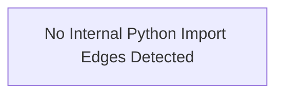
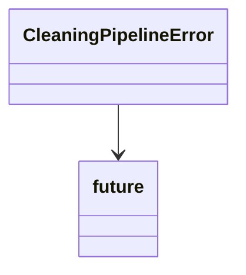

# Architecture Overview

This skill implements data profiling and cleaning automation scripts, with orchestration and reporting modules coordinating profiling runs, transformation checks, and artifact generation for cleaned datasets.

## Repository Structure

| File | Summary |
|------|---------|
| `scripts/catalog.py` | DM-103 transformation catalog. |
| `scripts/deliver_cleaning_outputs.py` | Stage 17 — Deliver cleaning outputs. |
| `scripts/deliver_outputs.py` | Stage 9 — Deliver profiling outputs. |
| `scripts/detect_quality_issues.py` | Stage 3 — Detect data quality issues. |
| `scripts/execute_transformations.py` | Stage 13 — Execute approved transformations. |
| `scripts/generate_charts.py` | Stage 6 — Generate inline charts via matplotlib. |
| `scripts/high_impact.py` | Detect high-impact transformation conditions. |
| `scripts/install_dependencies.py` | Stage 1 — Install dependencies. |
| `scripts/load_inputs.py` | Stage 10 — Load Feature 1 outputs. |
| `scripts/metrics.py` | Before/after metric capture for step execution. |
| `scripts/mistake_log.py` | Mistake log utility (DM-112). |
| `scripts/orchestrator.py` | Orchestrator — Skill A Feature 1 (Data Profiling). |
| `scripts/orchestrator_f2.py` | Orchestrator — Skill A Feature 2 (Data Cleaning). |
| `scripts/run_id.py` | Run ID generation for the Skill A pipeline. |
| `scripts/run_profiling.py` | Stage 4 — Run ydata-profiling. |
| `scripts/scan_jargon.py` | Stage 16 — Jargon scan (script + LLM hybrid). |
| `scripts/scan_pii.py` | Stage 5 — Scan for PII. |
| `scripts/schemas.py` | Data schemas for Feature 1 (Data Profiling). |
| `scripts/schemas_f2.py` | Feature 2 data schemas — DM-101 through DM-113. |
| `scripts/step_1_column_names.py` | Step 1 — Column name standardization. |
| `scripts/step_2_drop_missing.py` | Step 2 — Drop all-missing columns. |
| `scripts/step_3_type_coercion.py` | Step 3 — Type coercion. |
| `scripts/step_4_invalid_categories.py` | Step 4 — Invalid category cleanup. |
| `scripts/step_5_imputation.py` | Step 5 — Missing value imputation. |
| `scripts/step_6_deduplication.py` | Step 6 — Deduplication. |
| `scripts/step_7_outliers.py` | Step 7 — Outlier treatment. |
| `scripts/thresholds.py` | DM-108 high-impact thresholds. |
| `scripts/validate_input.py` | Stage 2 — Validate input CSV. |

## System Architecture

## Key Modules

### scripts/orchestrator_f2.py

High-impact module identified by Scout: high LOC (929).

### scripts/orchestrator.py

High-impact module identified by Scout: high LOC (585).

### scripts/execute_transformations.py

High-impact module identified by Scout: many imports (17).

## Hotspots

| File | LOC | Functions | Imports | Fan-in | Fan-out | Reason |
|------|-----|-----------|---------|--------|---------|--------|
| `scripts/orchestrator_f2.py` | 929 | 8 | 14 | 0 | 0 | high LOC (929) |
| `scripts/orchestrator.py` | 585 | 8 | 13 | 0 | 0 | high LOC (585) |
| `scripts/execute_transformations.py` | 376 | 5 | 17 | 0 | 0 | many imports (17) |

## Diagrams

### Class Diagram - scripts/orchestrator_f2.py

### Call Graph - scripts/orchestrator_f2.py

```mermaid
flowchart TD
  _stub_propose --> profiling_data_get
  _stub_propose --> all
  _stub_propose --> d_get
  _stub_propose --> det_get
  _stub_propose --> append
  _stub_propose --> len
  _stub_propose --> get
  _stub_propose --> columns_items
  _stub_propose --> col_info_get
  _stub_review --> transformation_plan_get
  _stub_review --> t_get
  _stub_review --> reviews_append
  _stub_verify_output --> len
  _stub_generate_report --> lines_append
  _stub_generate_report --> approved_plan_get
  _stub_generate_report --> len
  _stub_generate_report --> t_get
  _stub_generate_report --> min
  _stub_generate_report --> max
  _stub_generate_report --> title
  _stub_generate_report --> step_name_replace
  _stub_generate_report --> SCORE_TO_BAND_get
  _stub_generate_report --> impact_parts_append
  _stub_generate_report --> join
  _stub_generate_report --> r_get
  _stub_generate_report --> s_get
  _stub_generate_report --> flag_get
  _stub_generate_report --> verification_result_get
  _stub_generate_report --> sum
  _stub_generate_report --> mistake_log_counts_values
  _stub_generate_report --> mistake_log_counts_items
  _merge_to_approved_plan --> review_output_get
  _merge_to_approved_plan --> transformation_plan_get
  _merge_to_approved_plan --> review_by_id_get
  _merge_to_approved_plan --> approved_append
  _merge_to_approved_plan --> t_get
  _merge_to_approved_plan --> rejected_append
  _merge_to_approved_plan --> review_get
  _merge_to_approved_plan --> STEP_DEPENDENCY_MAP_items
```

