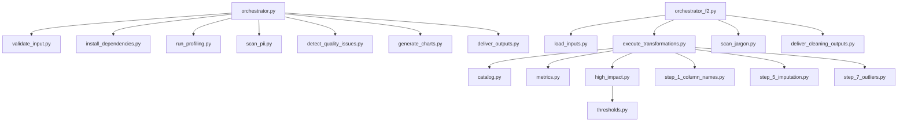
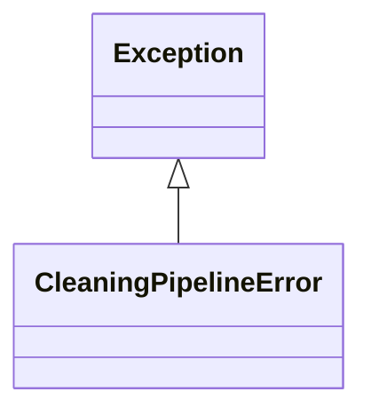
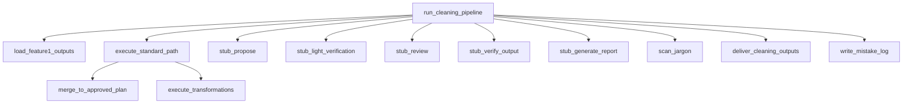

# Architecture Overview

> This skill directory provides the Python implementation for data profiling
> (Feature 1) and data cleaning (Feature 2). Two orchestrators run the staged
> pipelines, while shared schemas, metrics, catalogs, and step modules execute
> deterministic transformations and deliver outputs.

## Repository Structure

| File | Summary |
|------|---------|
| scripts/catalog.py | Transformation catalog for cleaning steps and required parameters that must stay in sync with prompts and docs. |
| scripts/deliver_cleaning_outputs.py | Stage 17 output delivery for Feature 2: write cleaned CSV, report, metadata, and mistake log. |
| scripts/deliver_outputs.py | Stage 9 output delivery for Feature 1: write summary, profiling JSON, HTML report, and charts. |
| scripts/detect_quality_issues.py | Stage 3 data quality checks for duplicates, special chars, all-missing columns, and mixed types. |
| scripts/execute_transformations.py | Stage 13 execution engine for approved transformations with metrics and high-impact checks. |
| scripts/generate_charts.py | Stage 6 chart generation for the profiling report using matplotlib. |
| scripts/high_impact.py | High-impact change detection using DM-108 thresholds. |
| scripts/install_dependencies.py | Stage 1 dependency installer for ydata-profiling with verification. |
| scripts/load_inputs.py | Stage 10 loader for Feature 1 outputs (profiling JSON, report, raw CSV) with validation. |
| scripts/metrics.py | Before/after metric capture for transformations at dataset and column levels. |
| scripts/mistake_log.py | DM-112 mistake log helpers for building and writing the transformation log. |
| scripts/orchestrator.py | Feature 1 pipeline orchestrator (stages 1-9) with optional LLM hooks. |
| scripts/orchestrator_f2.py | Feature 2 pipeline orchestrator (stages 10-17) with LLM hooks and mistake logging. |
| scripts/run_id.py | Run ID generator used across profiling and transformation runs. |
| scripts/run_profiling.py | Stage 4 ydata-profiling execution and DM-006 statistics extraction. |
| scripts/scan_jargon.py | Stage 16 jargon scan for undefined acronyms with optional LLM fix. |
| scripts/scan_pii.py | Stage 5 PII scan (layer 1) and candidate selection for layer 2 review. |
| scripts/schemas.py | Feature 1 schema definitions and validators for DM-001 to DM-010. |
| scripts/schemas_f2.py | Feature 2 schema definitions and validators for DM-101 to DM-113. |
| scripts/step_1_column_names.py | Step 1 column-name standardization strategies. |
| scripts/step_2_drop_missing.py | Step 2 drop-all-missing columns with safety checks. |
| scripts/step_3_type_coercion.py | Step 3 type coercion and parsing strategies. |
| scripts/step_4_invalid_categories.py | Step 4 invalid-category cleanup strategies. |
| scripts/step_5_imputation.py | Step 5 missing-value imputation with deterministic strategies. |
| scripts/step_6_deduplication.py | Step 6 deduplication strategies and helpers. |
| scripts/step_7_outliers.py | Step 7 outlier handling strategies. |
| scripts/thresholds.py | DM-108 high-impact thresholds used by the transformation checks. |
| scripts/validate_input.py | Stage 2 CSV validation and run ID creation. |

## System Architecture

## Key Modules

### orchestrator.py

Runs the profiling pipeline end-to-end, delegating to validation, profiling,
PII scanning, chart generation, and output delivery. It supports optional LLM
hooks with deterministic fallbacks.

### orchestrator_f2.py

Runs the cleaning pipeline end-to-end, coordinating LLM hooks for proposing,
reviewing, verifying, and reporting transformations, and then executing the
approved plan with mistake-log persistence.

### execute_transformations.py

Central execution engine for the seven cleaning steps. It validates required
parameters, records metrics, applies high-impact checks, and dispatches to
step modules.

### catalog.py

Defines the authoritative transformation catalog and required parameters that
the execution engine and prompts must share.

### schemas.py and schemas_f2.py

Typed schema validators for Feature 1 and Feature 2 data models, used across
stages to validate inputs and handoffs.

### validate_input.py

Performs the initial CSV validation and produces the run ID plus DM-002
validation metadata.

### run_profiling.py

Executes ydata-profiling and extracts DM-006 statistics from the report output.

## Hotspots

| File | LOC | Functions | Imports | Fan-in | Fan-out | Reason |
|------|-----|-----------|---------|--------|---------|--------|
| scripts/execute_transformations.py | 376 | 5 | 17 | 0 | 0 | many imports (17) |
| scripts/orchestrator.py | 585 | 8 | 13 | 0 | 0 | high LOC (585) |
| scripts/orchestrator_f2.py | 929 | 8 | 14 | 0 | 0 | high LOC (929) |

## Diagrams

### Class Diagram

### Call Graph

